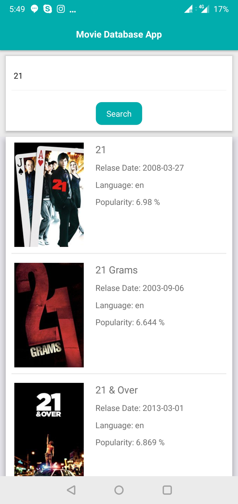
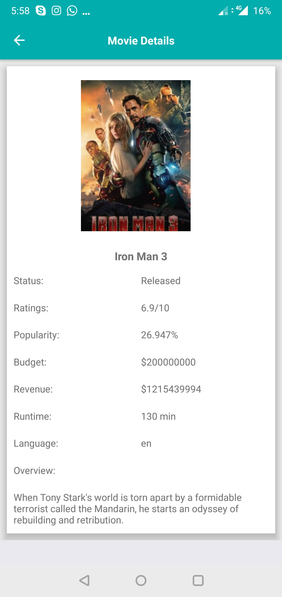

To setup this application on your system first run the following command:
`npm install`.

To run this application on iOS device use `react-native run-ios` and for android use `react-native run-android`.

## About Components
Here there are namely two components or screens i.e.
 * MainScreen Component
 * SecondScreen Component

The MainScreen component is the first screen that loads when an app starts. This screen consists of a search bar where you search your movie and then according to your search you get your results below.

On clicking the movie you will be redirected to screen 2 which is the SecondScreen.
On this screen you will see the details about the movie which was selected.

## About DB and APIs
TMDB was used for searching the movies.
At first create developers account on TMDB and then generate your API key. Using this key you can search movies.

Two APIS were used in this project:
* https://api.themoviedb.org/3/search/movie?query=jungle&api_key={your key} - To search movies.
* https://api.themoviedb.org/3/movie/{movieID}?api_key={your key} - To get detailed information about a particular movie.

## React-Native Packages Used

React-Navigation:  For navigation purpose.

## Screenshots

